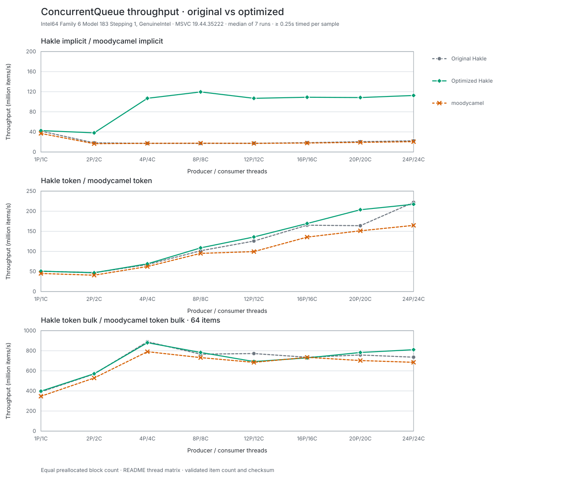
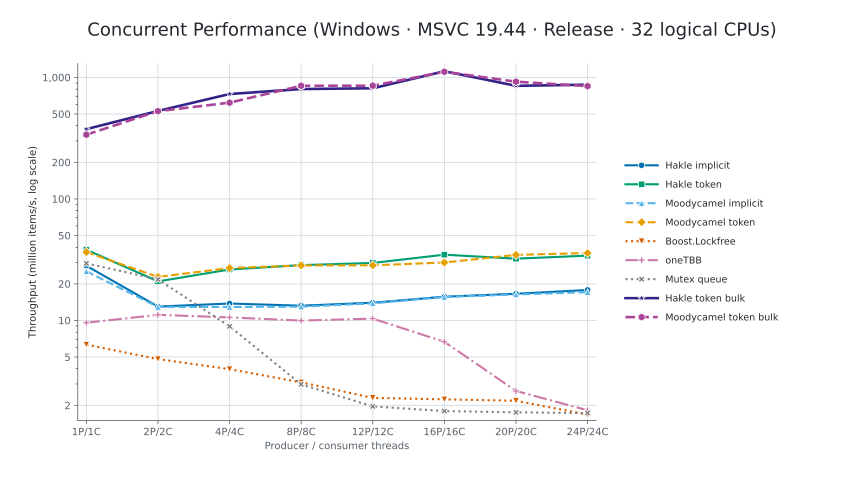

# LockFreeStructures

LockFreeStructures is a header-only C++20 library for concurrent data
structures, providing a wrapper based on `moodycamel::ConcurrentQueue`. Its
primary interface is `hakle::ConcurrentQueue<T>`, an MPMC queue built around
moodycamel's per-producer subqueue design.

## Features

- Implicit producers and explicit `ProducerToken` / `ConsumerToken` APIs
- Single-item and bulk enqueue/dequeue operations
- Customizable allocators, blocks, block managers, and queue traits
- Thread-local cached scheduling for token-less dequeue, configurable through traits
- Optional packed-word flags for bulk-oriented explicit producers
- Sharded slab and arena block managers for allocation-heavy workloads
- Header-only integration

The queue preserves FIFO order within each producer, but it does not define a
single global order across producers. Tokens belong to the queue that created
them, and a producer token must not be used concurrently by multiple producer
threads.

## Quick start

```cpp
#include "ConcurrentQueue/ConcurrentQueue.h"

hakle::ConcurrentQueue<int> queue;
queue.Enqueue(42);

int value = 0;
if (queue.TryDequeue(value)) {
  // value == 42
}
```

Explicit tokens can reduce repeated producer and consumer lookup:

```cpp
#include "ConcurrentQueue/ConcurrentQueue.h"

hakle::ConcurrentQueue<int> queue;
auto producer = queue.GetProducerToken();
auto consumer = queue.GetConsumerToken();

queue.EnqueueWithToken(producer, 7);

int value = 0;
queue.TryDequeue(consumer, value);
```

## Build and test

The project is tested with CMake and CTest. Each `test/test_*.cc` source is
built as a separate test executable.

```sh
cmake -S . -B build \
  -DBUILD_TESTING=ON \
  -DLOCKFREESTRUCTURES_BUILD_BENCHMARKS=OFF
cmake --build build --parallel
ctest --test-dir build --output-on-failure
```

For multi-config generators such as Visual Studio, add `--config Debug` to the
build and test commands. The suite covers the queue API, tokens, bulk
operations, MPMC behavior, per-producer FIFO ordering, move semantics, object
lifetime, exception recovery, and allocator propagation.

## Benchmarks

The optimization comparison below uses the same balanced thread matrix for
Original Hakle, Optimized Hakle, and the matching moodycamel API. Optimized
Hakle combines the two changes that are enabled on the default queue: the
thread-local consumer cache on token-less dequeue and direct dispatch on the
explicit `ProducerToken` path. It deliberately keeps the original byte flags.

The results were collected on Windows with MSVC 19.44 in Release mode on a
32-logical-processor host. Each point is the median of 7 deterministically
interleaved samples with at least 0.25 seconds of timed work per sample. Queue
construction is outside the timed region; every queue receives the same number
of preallocated blocks, and every run validates the final item count and
checksum.



The summary below reports the median percentage across the eight balanced
configurations from 1P/1C through 24P/24C. The range is included because the
smaller direct-dispatch change is sensitive to scheduler noise.

| Path | Enabled optimization | Versus Original Hakle | Versus moodycamel |
| --- | --- | ---: | ---: |
| Implicit scalar | Thread-local consumer cache | **+459.2%** (+2.5% to +598.2%) | **+486.7%** (+15.3% to +580.0%) |
| `ProducerToken` scalar | Direct producer dispatch | **+2.8%** (-2.2% to +24.3%) | **+20.0%** (+11.0% to +36.6%) |
| `ProducerToken` bulk, 64 items | Direct producer dispatch | **+1.1%** (-10.3% to +10.2%) | **+9.7%** (-0.7% to +18.3%) |

The optimized curve uses the consumer-cache samples for token-less paths and
the direct-dispatch samples for explicit-token paths. Those changes affect
disjoint API paths and together match the current default queue configuration.

### Fixed scenario: many producers, one token-less consumer

The old token-less dequeue path rescored the producer list on every call. A
thread-local `ConsumerToken` cache removes that repeated scan. The fan-in case
makes this cost visible without relying on balanced P=C behavior:

| Scenario | Original Hakle M items/s | Optimized Hakle M items/s | Improvement | Versus moodycamel |
| --- | ---: | ---: | ---: | ---: |
| 1P/1C | 41.72 | 42.31 | +1.4% | +12.5% |
| 4P/1C | 45.29 | 56.70 | +25.2% | +25.1% |
| 8P/1C | 45.73 | 57.49 | +25.7% | +28.7% |
| 16P/1C | 40.89 | 57.46 | +40.5% | +33.6% |
| 24P/1C | 32.22 | 57.92 | +79.8% | +42.2% |

Across all eight fan-in points, the median improvement is **+28.5%**. Custom
traits can restore the scan-based behavior with
`UseImplicitConsumerCache = false` when thread-local cache state is undesirable.

### Fixed scenario: shared sharded manager under a deep burst

`SlabBlockManager<..., 32>` is useful when many implicit producer queues share
one manager, the initial pool is zero, and producers create a deep burst before
the queue is drained. A 21-repetition direct A/B test timed concurrent enqueue
only; queue construction and final drain were outside the timed region.

| Producers | Default manager M items/s | ShardedSlab32 M items/s | Improvement |
| ---: | ---: | ---: | ---: |
| 1 | 280.82 | 357.40 | +27.3% |
| 4 | 803.70 | 934.80 | +16.3% |
| 8 | 944.29 | 1055.69 | +11.8% |
| 16 | 1023.02 | 1101.02 | +7.6% |
| 24 | 1026.78 | 1091.31 | +6.3% |

The median improvement across all eight producer counts is **+10.5%**; 20
producers was effectively neutral at -0.1%. In the separate same-run control,
ShardedSlab32 was 27.1% to 76.5% faster than moodycamel in this specific burst
workload. This manager remains opt-in: it retains slabs until destruction and
can hold up to 31 unused blocks per active allocation shard.

### Optional WordFlags policy

`HakleWordFlagsBlock` trades a byte flag store for an atomic word RMW. The
controlled comparison against direct dispatch with byte flags shows why it is
not the default:

| Explicit-token workload | Median change | Range |
| --- | ---: | ---: |
| Scalar | **-11.2%** | -17.6% to -9.0% |
| Bulk, 64 items | **+3.1%** | -3.8% to +12.5% |

Use it only when the workload is bulk-heavy and the scalar regression is an
acceptable trade-off.

Raw optimization results are available in:

- [`benchmark/results/windows-msvc-19.44-balanced-optimization-ablation-2026-08-20.json`](benchmark/results/windows-msvc-19.44-balanced-optimization-ablation-2026-08-20.json)
- [`benchmark/results/windows-msvc-19.44-fan-in-consumer-cache-2026-08-20.json`](benchmark/results/windows-msvc-19.44-fan-in-consumer-cache-2026-08-20.json)
- [`benchmark/results/windows-msvc-19.44-sharded-manager-burst-2026-08-20.json`](benchmark/results/windows-msvc-19.44-sharded-manager-burst-2026-08-20.json)
- [`benchmark/results/windows-msvc-19.44-sharded-manager-burst-confirmation-2026-08-20.json`](benchmark/results/windows-msvc-19.44-sharded-manager-burst-confirmation-2026-08-20.json)

Regenerate the main comparison from a Visual Studio 2022 Developer Command
Prompt with:

```bat
python benchmark/run_queue_optimization_ablation.py ^
  --compiler cl --baseline-ref custom_dev --repetitions 7 ^
  --minimum-seconds 0.25 --paths implicit token bulk ^
  --scenario-set balanced ^
  --output benchmark/results/local-queue-optimization-ablation.json
python benchmark/plot_queue_optimization_ablation.py ^
  benchmark/results/local-queue-optimization-ablation.json ^
  --output docs/queue-optimization-comparison.svg
```

### Broad queue comparison

The optional Google Benchmark target also compares Hakle's implicit, token,
and token-bulk paths with moodycamel, Boost.Lockfree, oneTBB, and a
mutex-protected `std::queue`. Google Benchmark and oneTBB are loaded from
`thirdparty/` when available, or fetched at configure time. Boost 1.74 or newer
must be installed or supplied through `BOOST_ROOT`.

```sh
cmake -S . -B build \
  -DLOCKFREESTRUCTURES_BUILD_BENCHMARKS=ON \
  -DBOOST_ROOT=/path/to/boost
cmake --build build --config Release --target queue_benchmark --parallel
```

The broad comparison was rerun on 2026-08-20 with the same Windows/MSVC host
used above. Every point is the median of 7 randomly interleaved repetitions.
Hakle and moodycamel receive the same number of preallocated blocks, queue
construction is outside the timed region, and every run validates item count
and checksum. Boost.Lockfree, oneTBB, and the mutex queue do not expose an
equivalent block-pool interface, so the equal-block rule applies only to the
two block-based queues.

The added **Optimized Hakle implicit** curve selects the thread-local consumer
cache because it reproduced a clear positive result in this broad run:

| Selected path | Versus Original Hakle | Versus moodycamel |
| --- | ---: | ---: |
| Implicit scalar, consumer cache | **+762.5%** (+1.3% to +991.6%) | **+814.9%** (+23.2% to +1,028.9%) |

The ranges cover 1P/1C through 24P/24C. The total chart deliberately does not
label direct `ProducerToken` dispatch as a winning optimization: in this rerun
its median changes were -0.8% for scalar token operations and -3.4% for
64-item bulk operations. Those samples remain in the raw JSON. The sharded
manager is also excluded here because equal preallocation bypasses the
allocation/recycling pressure that it is designed to improve.

The vertical axis is logarithmic because bulk operations are substantially
faster than single-item operations.



Raw results are available in
[`benchmark/results/windows-msvc-19.44-broad-optimized-2026-08-20.json`](benchmark/results/windows-msvc-19.44-broad-optimized-2026-08-20.json).
After building `queue_benchmark`, reproduce the measurement with:

```sh
build/benchmark/bin/queue_benchmark \
  --benchmark_filter='^(BM_HakleImplicitEqualBlocks|BM_HakleOptimizedImplicitEqualBlocks|BM_MoodycamelImplicitEqualBlocks|BM_HakleTokensEqualBlocks|BM_HakleOptimizedTokensEqualBlocks|BM_MoodycamelTokensEqualBlocks|BM_BoostLockfree|BM_OneTBB|BM_MutexQueue|BM_HakleTokenBulkEqualBlocks|BM_HakleOptimizedTokenBulkEqualBlocks|BM_MoodycamelTokenBulkEqualBlocks)/' \
  --benchmark_repetitions=7 \
  --benchmark_enable_random_interleaving=true \
  --benchmark_display_aggregates_only=true \
  --benchmark_out=benchmark/results/local-broad-queue-comparison.json \
  --benchmark_out_format=json
```

Regenerate the chart with:

```sh
python -m pip install matplotlib
python benchmark/plot_benchmark.py \
  benchmark/results/local-broad-queue-comparison.json \
  --output docs/benchmark-throughput.svg
```

## Custom allocators

Allocators use the project's `HakeAllocatorTraits` protocol rather than
`std::allocator_traits`. An allocator supplies its value, pointer, reference,
and size types; `Allocate`, `Deallocate`, `Construct`, and `Destroy`; and
rebind support. See
[`test/test_allocator_and_lifetime.cc`](test/test_allocator_and_lifetime.cc)
for a complete example.

The default queue traits propagate the rebound allocator to both explicit and
implicit block managers, so their block pools and free lists use the same
allocator family.

## License

LockFreeStructures is licensed under the Apache License 2.0. See
[`NOTICE`](NOTICE) and
[`THIRD_PARTY_NOTICES.md`](THIRD_PARTY_NOTICES.md) for design attribution and
vendored dependency notices.
